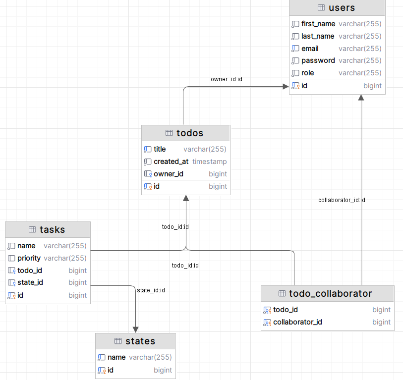

# Hibernate. Part 1
### Create entities that match the given SQL schema:


- **User:** with fields id, firstName, lastName, email, password, and role.
- **ToDo:** with fields id, title, createdAt, and owner_id.
- **Task:** with fields id, name, priority, todo_id, and state_id.
- **State:** with fields id and name.
- **TodoCollaborator:** to store collaboration between todo and users with fields todo_id and collaborator_id.

**Implement Hibernate Validator annotations for all entities:**

- **For User:**</br>
**firstName and lastName:** cannot be empty.</br>
**email:** must be a valid email format.</br>
**password:** must be at least 8 characters long, contain at least one uppercase letter, one lowercase letter, one number, and one special character !@#$%^&*()-_=+[]{}|;:'",.<>?/`~\ </br>
**Valid User:** Anna-Maria Kovalenko-Bynzar with@gcom.com email and qwQW12!@ password</br>

- **For ToDo:**</br>
**title:** cannot be empty.</br>
- **For Task:**</br>
**name:** must be between 3 and 200 characters.</br>
- **For State:**</br>
**name:** must be between 1 and 20 characters, and can only contain Latin letters, numbers, dashes, spaces, and underscores.</br>
  </br>
Write missing unit tests for all entities, similar to the UserTests class:


# Hibernate Entities and Validation Project

## Introduction
This project involves creating entities that match a provided SQL schema and implementing validation using Hibernate Validator annotations. The application ensures data integrity and enforces validation rules across multiple entities, including User, ToDo, Task, State, and TodoCollaborator. Comprehensive unit tests are included to verify the implementation.

---

## Table of Contents
- [Entities and Schema](#entities-and-schema)
- [Validation Rules](#validation-rules)
- [Setup and Installation](#setup-and-installation)
- [Unit Tests](#unit-tests)
- [Example Validations](#example-validations)
- [Contributors](#contributors)
- [License](#license)

---

## Entities and Schema

### 1. **User**
- Fields:
  - `id` (Primary Key)
  - `firstName`
  - `lastName`
  - `email`
  - `password`
  - `role`
  - `myTodos`
  - `otherTodos`

### 2. **ToDo**
- Fields:
  - `id` (Primary Key)
  - `title`
  - `createdAt`
  - `owner_id` (Foreign Key referencing User)
  - `tasks` (List of task related to this todo)
  - `collaborators` (Collaborators related to this todo)

### 3. **Task**
- Fields:
  - `id` (Primary Key)
  - `name`
  - `priority`
  - `todo_id` (Foreign Key referencing ToDo)
  - `state_id` (Foreign Key referencing State)

### 4. **State**
- Fields:
  - `id` (Primary Key)
  - `name`
  - `tasks`

### 5. **TodoCollaborator**
- Fields:
  - `todo_id` (Foreign Key referencing ToDo)
  - `collaborator_id` (Foreign Key referencing User)

---

## Validation Rules

### **User**
- `firstName` and `lastName`: Cannot be empty.
- `email`: Must be a valid email format.
- `password`:
  - Minimum 8 characters.
  - At least one uppercase letter.
  - At least one lowercase letter.
  - At least one number.
  - At least one special character: `!@#$%^&*()-_=+[]{}|;:'",.<>?/`~`.

### **ToDo**
- `title`: Cannot be empty.

### **Task**
- `name`: Must be between 3 and 200 characters.

### **State**
- `name`: Must be between 1 and 20 characters.
- Allowed characters: Latin letters, numbers, dashes, spaces, and underscores.

---

## Setup and Installation

1. **Clone the Repository**
   ```bash
   git clone https://github.com/Andrii-Kosteniuk/SoftServe-IT-academy-Hibernate-Part-1.git

2. Add Dependencies Add the following dependencies to your pom.xml or build.gradle:

   - Hibernate Validator
   - Jakarta Persistence API
   - JUnit for testing

Example for Maven:
```xml
<dependencies>
  <dependency>
    <groupId>org.springframework.boot</groupId>
    <artifactId>spring-boot-starter-web</artifactId>
  </dependency>

  <dependency>
    <groupId>org.springframework.boot</groupId>
    <artifactId>spring-boot-starter-test</artifactId>
    <scope>test</scope>
  </dependency>

  <dependency>
    <groupId>org.projectlombok</groupId>
    <artifactId>lombok</artifactId>
  </dependency>
  <dependency>
    <groupId>org.postgresql</groupId>
    <artifactId>postgresql</artifactId>
    <version>42.7.3</version>
  </dependency>

  <dependency>
    <groupId>com.h2database</groupId>
    <artifactId>h2</artifactId>
    <scope>test</scope>
  </dependency>

  <dependency>
    <groupId>org.springframework.boot</groupId>
    <artifactId>spring-boot-starter-data-jpa</artifactId>
  </dependency>

  <dependency>
    <groupId>org.springframework.boot</groupId>
    <artifactId>spring-boot-devtools</artifactId>
    <scope>runtime</scope>
  </dependency>
  <dependency>
    <groupId>org.springframework.boot</groupId>
    <artifactId>spring-boot-starter-validation</artifactId>
  </dependency>

</dependencies>
```
3. **Run Unit Tests** Use Maven or your IDE to run the unit tests:
```bash
   mvn test
